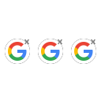
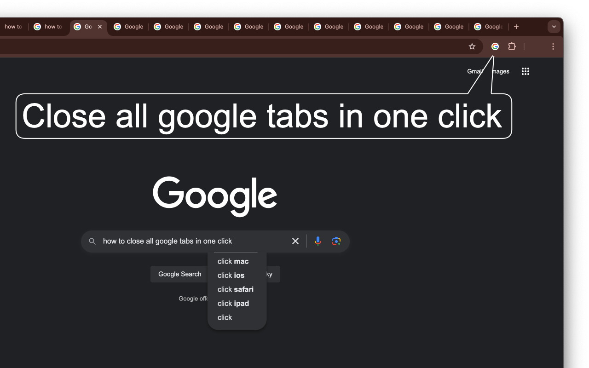

#  Close Google Tabs Extension

<b>Adds button to the extensions toolbar that closes all opened google.com pages</b>

## Requirements:

- `tabs` permission to check which URLs are opened

---

*We do not collect any data, see ["Privacy Policy"]("Privacy Policy.md") for details*